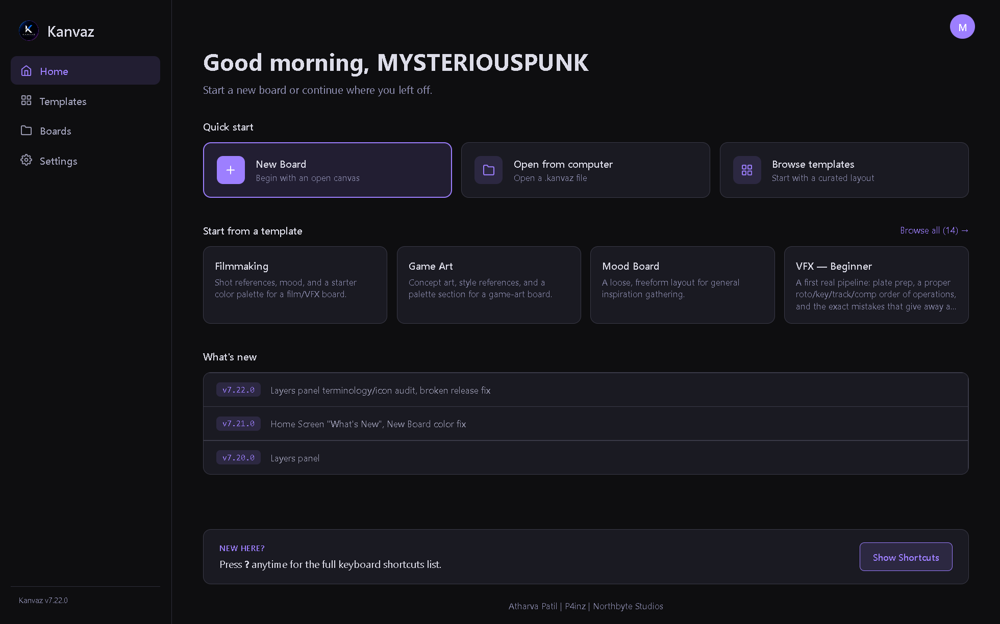
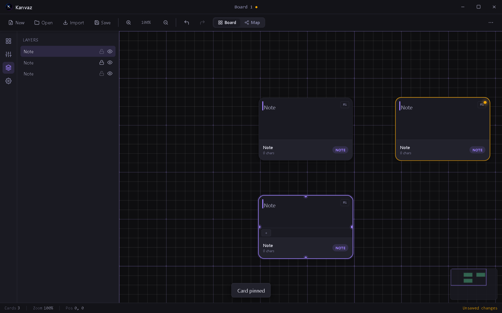
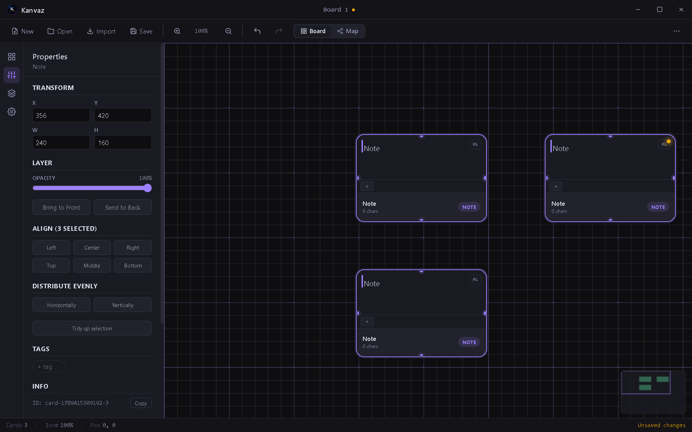
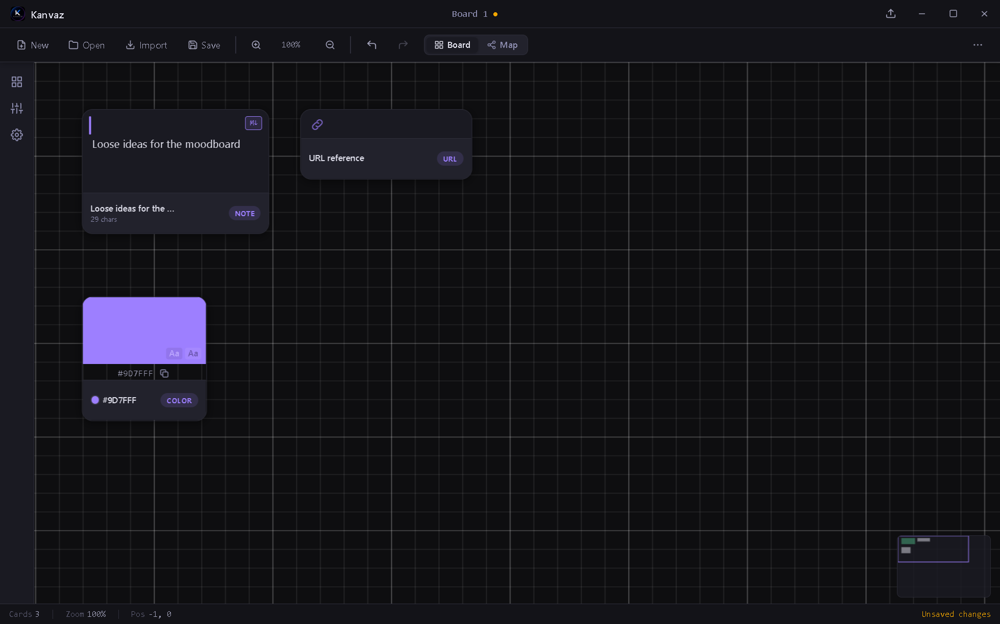

<p align="center">
  
</p>

<p align="center">
  <a href="https://github.com/p4inz-code/kanvaz/releases/latest"></a>
  <a href="https://github.com/p4inz-code/kanvaz/releases/latest"></a>
  <a href="https://github.com/p4inz-code/kanvaz/stargazers"></a>
  <a href="LICENSE"></a>
  
  
</p>

# Kanvaz

### The Reference Operating System, for artists who think in images, not folders.

Stop tabbing between fifty browser windows and a messy Explore folder. Kanvaz is a free, open-source, **100% offline** infinite canvas built for VFX artists, 3D artists, and anyone whose real workflow is collecting references, connecting ideas, and actually finding them again later.

Drop in images, video, audio, 3D models, PureRef boards, and files. Wire references together with typed connections. Share the same card across boards with zero duplication. Extend it with plugins, or write your own and sell it.

No account. No cloud. No subscription. Just a canvas that's actually yours.

<p align="center">

### [⬇ Download for Windows, it's free](https://github.com/p4inz-code/kanvaz/releases/latest)

</p>

> **Note:** Kanvaz isn't code-signed (certificates cost money; this app doesn't). Windows will likely show **"Windows protected your PC."** Click **"More info" → "Run anyway."** That's normal for unsigned indie software, not a red flag.
> Prebuilt installers are Windows only. macOS and Linux users build from source, see [Build installers](#build-installers).

<p align="center"><i>Built as an ongoing side project, no fixed roadmap, mostly driven by whatever feedback comes in. Found a bug or want a feature? <a href="https://github.com/p4inz-code/kanvaz/issues">Open an issue</a> or email <b>atharva.patil.cg@gmail.com</b>, both get read.</i></p>

---

## Latest release

**v7.26.0** fixes real Layers panel bugs caught by manual testing, not code review: right-clicking a layer row did nothing (no context menu was ever wired up), and selecting a row silently bumped it to the front, fighting any attempt to manually reorder layers. Right-click now shows the same context menu as an on-canvas card, selecting a row no longer touches z-order, and rows are now drag-to-reorder, same as Photoshop or Figma's own layers list. v7.25.0 before it added exporting the board or a selection as a real PNG image (canvas/card right-click menus), drawing each card's actual content instead of a placeholder: real pixels for image/video/GIF, wrapped text for notes, real fills for color cards. v7.24.0 added real board thumbnails on the Home Screen's Recent tiles, generated at save time from the actual card layout. Recent versions worth knowing about: a Layers panel (v7.20.0), card grouping and Isolate View (v7.19.0, v7.17.0), non-destructive Brightness/Contrast/Saturation on image and video cards (v7.18.0), and Tidy Up / Distribute Evenly / numbered view bookmarks for arranging a busy board fast (v7.14.0–v7.16.0). Every release, with the reasoning behind it, is in [CHANGELOG.md](CHANGELOG.md).

<p align="center">
  
</p>

<details>
<summary><b>More screenshots</b> — Layers panel, multi-select Align/Distribute/Tidy Up, classic card design</summary>
<br>

<p align="center">
  
  <br><i>Layers panel: every card in z-order, click to select, pin/hide icons.</i>
</p>

<p align="center">
  
  <br><i>Align, Distribute Evenly, and Tidy Up — all in the Properties panel.</i>
</p>

<p align="center">
  
  <br><i>Card design: always-visible name and metadata footer, one clean type badge.</i>
</p>

</details>

---

## Why Kanvaz

| | |
|---|---|
| 🖼️ **One canvas for everything** | Images, GIFs, video, audio, 3D models, notes, colors, URLs, and file pointers. Drop it in, arrange it freely, annotate on top. Multiple boards per file, each with its own view state. |
| 🔗 **Shared cards across boards** | The same card can live on more than one board with zero duplication. Edit it on either one, and the change is there next time you open the other. |
| 🧠 **Smart Search** | On-device, lemmatized/fuzzy search ("cars" finds "car"). Fully offline, off by default, about 4.5MB, zero native dependencies. |
| ✏️ **Real annotation tools** | Pen, arrow, rectangle, pixel-measure, and an eyedropper that samples actual pixel color, right on top of your reference. |
| 🕸️ **Connections + Map View** | Link any two references with typed, directional relationships. Visualize the whole web as a node-editor-style graph with bezier cables. |
| 🧩 **A real plugin ecosystem** | Add card types, commands, themes, or full features without forking Kanvaz. Sell your own plugin if you want. Kanvaz never takes a cut and never runs a marketplace. |
| 🔒 **100% offline, always** | No accounts, no telemetry, nothing phones home. The only network activity anywhere in the app is a button you click yourself (Check for Updates, Browse Plugins). Never automatic. |

---

## Features

**Canvas & organization**
- Infinite pan/zoom canvas (8%–500%), multiple boards per file
- Real board thumbnails on the Home Screen (generated from the actual card layout at save time)
- Image, GIF, video, and audio cards with full playback controls and a real volume slider
- 3D model cards (`.glb`/`.gltf`/`.obj`/`.fbx`, up to 150MB): orbit with the mouse, Normal/Wireframe/Matcap shading, animation playback with a scrub bar, background color picker
- Note, text, color, URL, and file-reference card types. A file reference pointing at a `.pdf` or image gets a real inline preview inside the resizable card
- Shared cards across boards: same content, no duplication, edit anywhere
- Tag editing, live search/filter (`/`), and Smart Folders (saved searches that re-run themselves)
- Color search: click a swatch, find every card that matches
- `.pur` file import via a toolbar button or drag-drop, both preserve position and scale
- Undo/redo up to 50 steps, autosave crash recovery, crash-safe atomic save
- Always-on-top by default (toggleable in Settings)

**Card design & templates**
- Every card shows an always-visible name and at-a-glance metadata (resolution, duration, character count) plus one clean type badge
- Photoshop/Illustrator-style Properties panel: Transform (X/Y/W/H), opacity, layer order, multi-select alignment, distribute-evenly, and Tidy Up, non-destructive Brightness/Contrast/Saturation for image/GIF/video, and Media info
- A Layers panel (its own side-panel tab): every card in z-order, click to select, drag to reorder, right-click for the full card menu, eye icon to hide/show, lock icon
- 13 board templates spanning VFX (three skill tiers), Game Dev, Music, Animation, Photography, Architecture, UI/UX, and Branding, plus the option to save your own board as a template

**Offline profiles**
- Fully offline, no-login multi-profile system: switch, create, or add a guest profile, each with its own settings, recent boards, and recovery data
- Export a profile to a portable file and import it on another machine, no network involved
- Per-profile plugin enable-state and storage, so two people sharing one install don't step on each other's plugin setup

**Annotation**
- Pen, highlighter, line, arrow, rectangle, ellipse, text stamp, pixel-measure, and eyedropper (real pixel sampling)
- Custom color picker with a recent-colors row, per-stroke opacity
- Video frame-stepping and onion-skin ghosting for checking animation timing
- Annotation toolbar scales with canvas zoom, so it doesn't shrink to nothing next to a zoomed-in card

**Connections**
- 7 typed relationship kinds (Related To, Inspired By, Derived From, Alternative To, Supports, Used In, References)
- Map View: node-editor-style graph, bezier tube connections, independent pan/zoom
- Connection Inspector panel (C): view, create, edit, delete from a side panel

**Plugin ecosystem**
- Drop a folder in, or one-click install from the in-app "Browse Official Plugins" catalog
- A richer runtime API: register card types, commands, themes, event hooks, even insert any card type from raw data
- MCP Bridge (official plugin): let an MCP-compatible AI client (Claude Desktop, Claude Code, and so on) read and edit your board locally, with every change undo-reversible
- Template Maker & Manager (official plugin): save boards as templates, browse and install community ones
- Explicit, considered permission to sell your own plugin. No in-app marketplace, ever

**Everything else**
- Command Palette (`Ctrl+K`): fuzzy-search and run any shortcut or plugin command
- Light/dark theme, type-aware context menus
- Settings migration across versions with zero data loss
- Developer tools: FPS overlay, ID overlays, one-click debug export for bug reports, with error toasts that actually show what went wrong

---

## Requirements

- Node.js 18+ ([nodejs.org](https://nodejs.org))
- npm 9+

---

## Run in development

```bash
npm install
npm start
```

---

## Build installers

**Windows (installer + portable):**
```bash
npm run build:win
```
Output: `dist/Kanvaz Setup 7.26.0.exe` and `dist/Kanvaz 7.26.0.exe`

**macOS:**
```bash
npm run build:mac
```

**Linux:**
```bash
npm run build:linux
```

---

## Keyboard shortcuts

| Key | Action |
|-----|--------|
| Scroll | Zoom in / out |
| Ctrl+Scroll | Fine zoom |
| Middle mouse / Space+drag | Pan |
| 0 | Reset zoom |
| F | Fit all cards |
| Ctrl+K | Command Palette, fuzzy-search any shortcut or plugin command |
| L | Toggle light / dark theme |
| Ctrl+S | Save board |
| Ctrl+Shift+S | Save board as new file |
| Ctrl+O | Open board |
| Ctrl+F or / | Search/filter cards |
| Ctrl+Z / Ctrl+Y | Undo / Redo |
| Ctrl+A | Select all cards |
| Ctrl+drag, or V then drag | Box-select multiple cards (V toggles the mode, Esc exits) |
| Delete | Delete selected card |
| Ctrl+D | Duplicate card |
| P | Pin / unpin card |
| A | Annotate selected card |
| C | Connections inspector |
| E | Properties panel |
| M | Toggle Board / Map view |
| H | Hide annotations |
| Arrow keys | Nudge card 1px |
| Shift+Arrow | Nudge card 10px |
| Shift (while resizing) | Lock aspect ratio |
| S | Settings (toggle open/close) |
| I | About (toggle open/close) |
| ? | Shortcuts overlay (toggle open/close) |
| Esc | Deselect / close panels / cancel wire |

---

## File format

As of 4.1.0, a `.kanvaz` file is a zip container: `board.json` (the board/card/connection structure) plus one file per embedded image/video/audio asset, each with a SHA-256 hash recorded for corruption detection. This replaced the old plain-JSON-with-everything-base64-encoded format, which inflated media by about 33% and put your whole board at risk if a single byte anywhere in that one giant JSON string got corrupted. A damaged asset now degrades to that one card showing "missing media" instead of threatening the rest of the file.

As of 6.4.0, `board.json` also carries a top-level `sharedCards` registry. The content of any card shared across boards lives there once, keyed by a stable id, with each board's own `cards[]` holding only a lightweight position/size stub that references it. This is fully additive: older files simply have no stubs referencing anything and load with an empty registry.

Files saved by 4.0.1 and earlier (plain JSON, base64 media) still open exactly as before. Kanvaz detects the format automatically and only ever writes the current container going forward. Connections are stored as a top-level `connections` array alongside boards. Files from v2.x load cleanly with zero connections.

---

## Known limitations

- Custom key-value properties are text values only, no dropdown/date/number field types yet.
- MKV and AVI video files may not play (a Chromium codec limitation). MP4 (H.264) and WebM are recommended. Kanvaz tells you plainly when this is why a video card failed, instead of a generic "missing media" message.
- PDF preview only covers viewing (scroll/zoom/page nav). There's no text selection, search-within-PDF, or annotation on top of a PDF page yet.
- Cross-board connections between two independent cards aren't possible from the UI (only one board's cards load at a time, so the "Connect to" picker only offers cards on the board you're on). As of 6.4.0, sharing the *same* card across boards is possible and covers most of what people actually want this for.
- Autosave writes to a recovery file only. "Unsaved changes" in the status bar clears only on explicit Save (Ctrl+S). The recovery file is cleared on every clean close, so the "Recover unsaved board?" prompt only appears after an actual crash.
- The base installer bundles zero plugins by design (see [SECURITY.md](SECURITY.md)'s Plugin System section). Theme Creator, MCP Bridge, and Template Maker & Manager all install separately, the same way any third-party plugin does.
- `registerPropertyFieldType` (custom Properties panel field types via a plugin) is still unimplemented.
- 3D model cards embed the file (like image/video/audio) rather than pointing at it. A `.gltf` that references external `.bin`/texture files by relative path won't fully resolve (only a self-contained `.gltf` or a `.glb` is guaranteed to render everything); `.fbx` support is best-effort, since it's the most complex and least standardized of the four formats. Camera orbit position isn't saved, so every load starts from the same framed default view. Custom user-swappable textures aren't supported yet (planned as a future plugin).
- Per-profile plugin *storage* is isolated, but installed plugin code is still shared across all profiles on one machine, since installing a plugin is treated as a machine-level action, not a per-profile one.

---

## Roadmap

Kanvaz keeps getting developed as an ongoing side project, no fixed deadline, mostly driven by real feedback. The living plan lives in [docs/ROADMAP.md](docs/ROADMAP.md); the current batch in progress:

- Select, move, and delete an individual existing annotation stroke (today "Clear annotations" is all-or-nothing)
- A first-run "Set up your profile" screen and a profile picker built into the Start Screen itself
- Font and HDRI/EXR preview support
- General UI polish, ongoing

---

## Documentation

- [Technical Overview](docs/TECHNICAL_OVERVIEW.md): architecture, module map, build conventions
- [Privacy](PRIVACY.md): what Kanvaz does (and doesn't) do with your data
- [Third-Party Notices](THIRD_PARTY_NOTICES.md): licensing for Electron and other bundled components
- [Changelog](CHANGELOG.md): version history

---

## Related projects

Same engineering philosophy, same author, adjacent problem spaces:

- [3d-ref-skills](https://github.com/p4inz-code/3d-ref-skills)
- [reference-engineering](https://github.com/p4inz-code/reference-engineering) — the reference-engineering concept itself, proposed and developed independently of Kanvaz

## License

MIT, free forever.
Made by Atharva Patil | **[P4inz](https://github.com/p4inz-code)** | Northbyte Studios, Navi Mumbai, India.

<p align="left">
  <a href="https://github.com/p4inz-code"></a>
</p>
