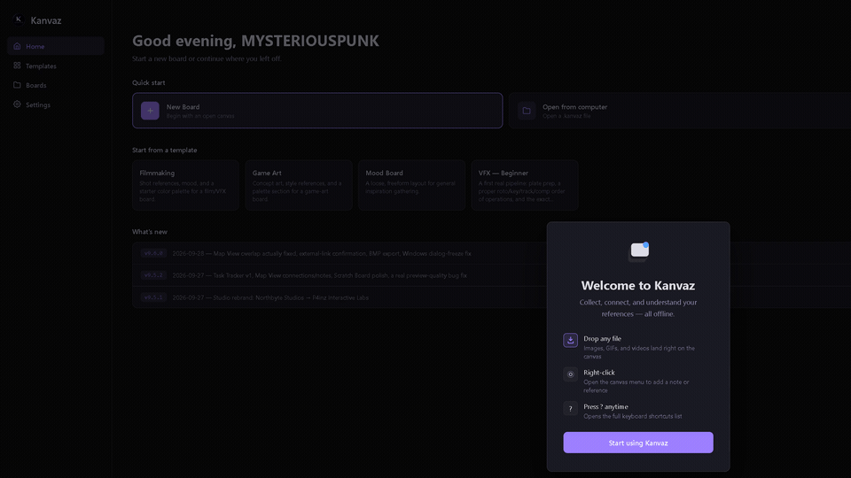
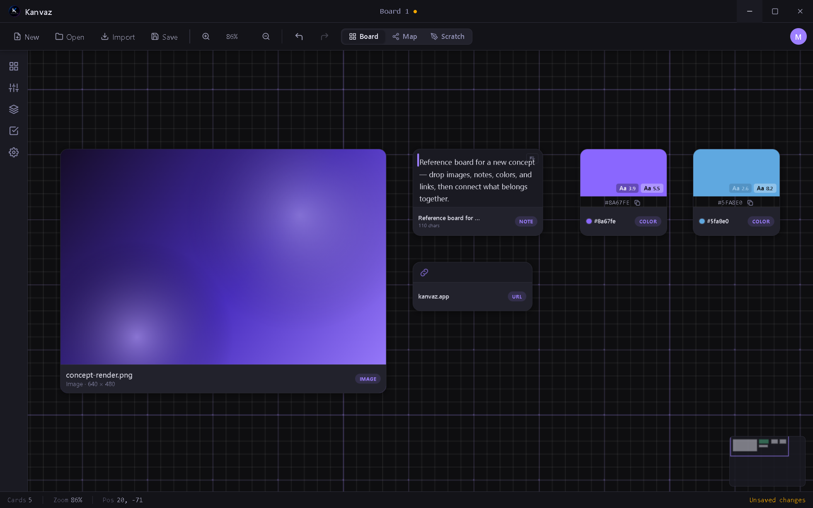
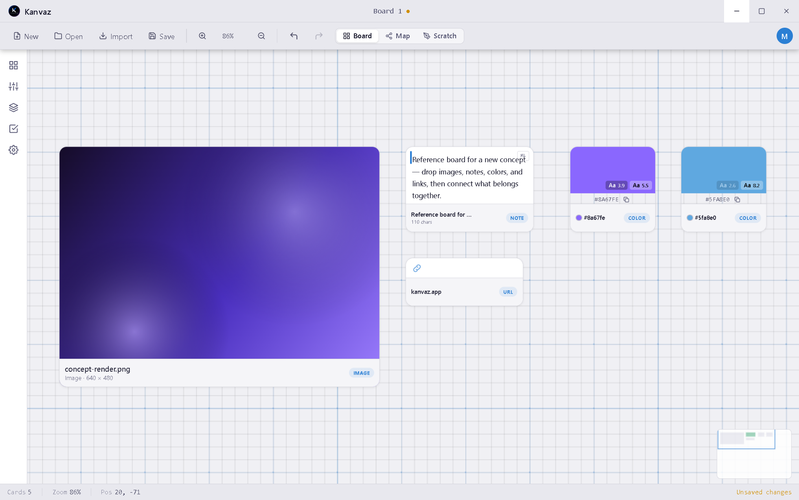
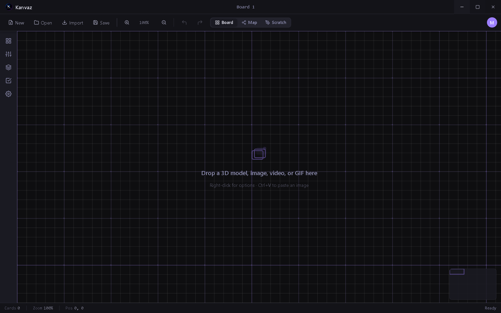
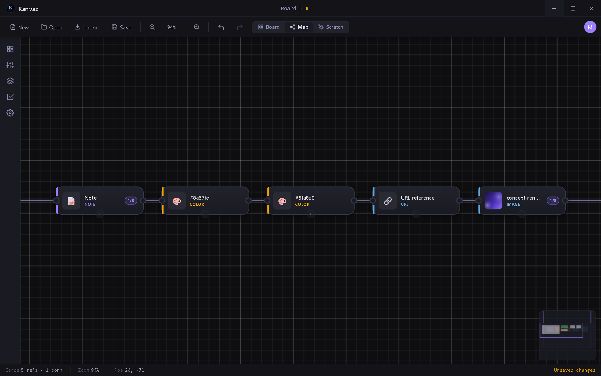
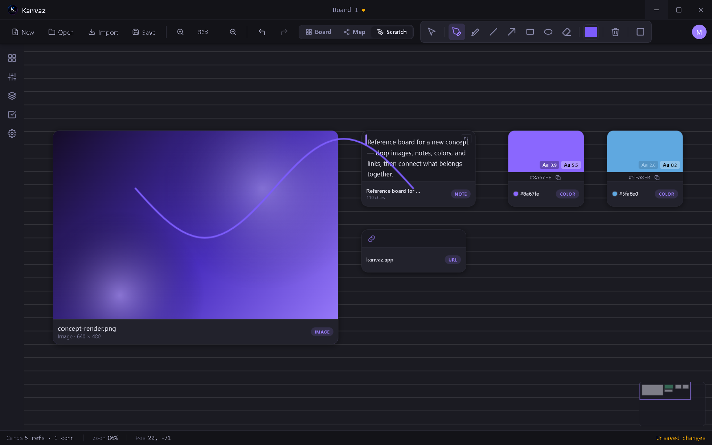
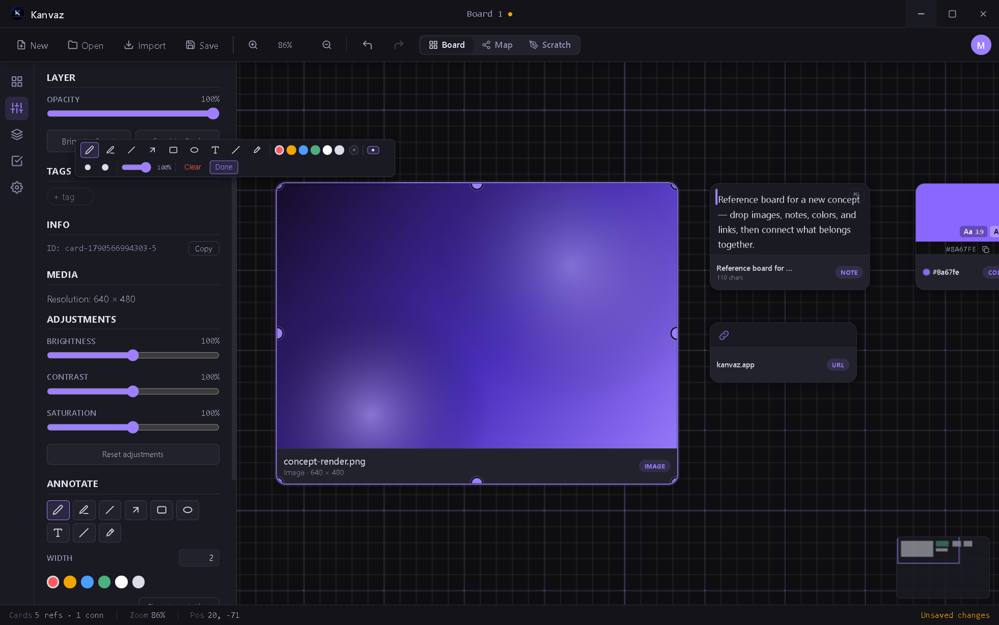
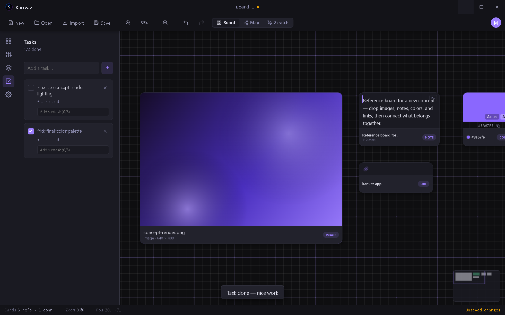
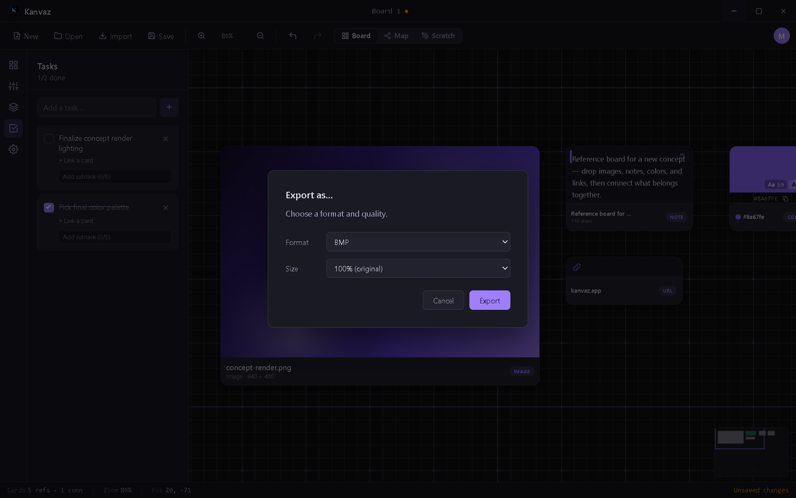

<p align="center">
  
</p>

<p align="center">
  <a href="https://github.com/p4inz-code/kanvaz/releases/latest"></a>
  <a href="https://github.com/p4inz-code/kanvaz/releases/latest"></a>
  <a href="https://github.com/p4inz-code/kanvaz/stargazers"></a>
  <a href="LICENSE"></a>
  
  
</p>

<p align="center">
  <a href="https://github.com/p4inz-code/kanvaz/commits/main"></a>
  <a href="https://github.com/p4inz-code/kanvaz/commits/main"></a>
  <a href="https://discord.gg/8UKt8s5FbW"></a>
</p>

# Kanvaz

### The Reference Operating System, for artists who think in images, not folders.

You've got fifty browser tabs open, a folder called "refs_final_v2," and no idea which image the client actually meant. Kanvaz is a free, open-source, **100% offline** infinite canvas for VFX artists, 3D artists, and anyone whose real workflow is collecting references, connecting ideas, and finding them again six months later.

Drop in 3D models, images, video, audio, PureRef boards, and files. Wire references together with typed connections and see the whole web of them as a real graph. Share the same card across boards with zero duplication. Extend it with plugins, or write your own and sell it.

No account. No cloud. No subscription. Just a canvas that's actually yours.

<p align="center">

### [⬇ Download for Windows | Linux | Mac, it's free](https://github.com/p4inz-code/kanvaz/releases/latest)

</p>

> **Note:** Kanvaz isn't code-signed (certificates cost money; this app doesn't). Windows will likely show **"Windows protected your PC."** Click **"More info" → "Run anyway."** On macOS, Gatekeeper will say the app "cannot be opened" the first time — right-click (or Control-click) the app and choose **Open**, then confirm once, and it will launch normally after that. Both are normal for unsigned indie software, not a red flag.
> Prebuilt installers are cross platform. See [Build installers](#build-installers).

If you've used PureRef and wanted more than static images, or tried a cloud moodboard tool and didn't want an account standing between you and your own files, this is built for exactly that gap.

---

<p align="center">
  
</p>

<table>
<tr>
<td width="50%" align="center">
<b>🌙 Dark theme</b><br><br>

</td>
<td width="50%" align="center">
<b>☀️ Light theme</b><br><br>

</td>
</tr>
</table>
<p align="center"><i>Same board, either theme — press <code>L</code> to switch, no restart needed.</i></p>

<details>
<summary><b>More screenshots</b> — Home Screen, Map View, Scratch Board, side panel (Properties/Annotate, Task Tracker), export</summary>
<br>

<p align="center">
  
</p>

<p align="center">
  
  <br><i>Map View: every card as a node, color-coded by type, wired together with typed connections.</i>
</p>

<p align="center">
  
  <br><i>Scratch Board: a real drawing layer over your board — pen, highlighter, shapes, eraser, shares the same undo history as everything else.</i>
</p>

<p align="center">
  
  <br><i>Annotate any card directly, with per-card brush width and color adjustable right from Properties.</i>
</p>

<p align="center">
  
  <br><i>Task Tracker: a real to-do list living next to your board, with subtasks and per-task card links.</i>
</p>

<p align="center">
  
  <br><i>Export as… — turn any image/GIF/video card into PNG, JPEG, WEBP, or BMP, at any scale.</i>
</p>

</details>

---

## What makes Kanvaz different

Most reference boards stop at "put images on a canvas." These are the ones worth trying first:

- **Real 3D model preview, not a static thumbnail.** Drop in a `.glb`/`.gltf`/`.obj`/`.fbx`/`.stl`/`.ply`/`.vox`/`.usd`/`.usdz` and orbit it live, right on the board — Normal/Wireframe/Matcap shading, animation playback with a scrub bar. `.blend` files preview too, if you have Blender installed; without it, they become a plain file reference instead of failing outright.
- **Typed connections, visualized as a real graph.** Not just arrows — 7 relationship kinds (Inspired By, Derived From, Used In, Supports, and more), viewable as a node-editor-style Map View when you want to see the whole web of ideas at once. Every bundled template except the freeform Mood Board ships with real connections already wired up, so you see the feature working the moment you open one.
- **One card, many boards, zero duplication.** Share a reference across a Character board and a Lighting board — edit it once, and it updates everywhere it's used. Most tools make you choose between duplicating a file or losing track of where it lives.
- **An AI can read and edit your board locally, with your permission.** The MCP Bridge plugin lets Claude Desktop or Claude Code query and modify the active board over local IPC, never the network — every change is undo-reversible like anything else you'd do by hand.
- **Sell your own plugin. Kanvaz never takes a cut.** Register card types, commands, or full themes through a real runtime API — there's no in-app marketplace standing between you and the people who'd pay for your plugin.
- **100% offline, and it stays that way.** No account to lose access to, no subscription that stops working, no telemetry phoning home. The only network calls anywhere in the app are ones you click yourself.

---

## Why Kanvaz

| | |
|---|---|
| 🖼️ **One canvas for everything** | 3D models, images, GIFs, video, audio, notes, colors, URLs, and file pointers. Drop it in, arrange it freely, annotate on top. Multiple boards per file, each with its own view state. |
| 🔗 **Shared cards across boards** | The same card can live on more than one board with zero duplication. Edit it on either one, and the change is there next time you open the other. |
| 🧠 **Smart Search** | On-device, lemmatized/fuzzy search ("cars" finds "car"). Fully offline, off by default, about 4.5MB, zero native dependencies. |
| ✏️ **Real annotation tools** | Pen, arrow, rectangle, pixel-measure, and an eyedropper that samples actual pixel color, right on top of your reference. |
| 🕸️ **Connections + Map View** | Link any two references with typed, directional relationships. Visualize the whole web as a node-editor-style graph with bezier cables. |
| 🧩 **A real plugin ecosystem** | Add card types, commands, themes, or full features without forking Kanvaz. Sell your own plugin if you want. Kanvaz never takes a cut and never runs a marketplace. |
| 🔒 **100% offline, always** | No accounts, no telemetry, nothing phones home. The only network activity anywhere in the app is a button you click yourself (Check for Updates, Browse Plugins). Never automatic. |

---

## How Kanvaz compares

PureRef and Refern are both genuinely good, actively maintained tools — this is where Kanvaz actually differs from them.

| | Kanvaz | PureRef | Refern | Miro |
|---|---|---|---|---|
| Price | Free, MIT | Free | $35 one-time | Subscription; free tier caps at 3 editable boards |
| Offline / no account | Yes, always | Yes | Yes | No — cloud-only |
| 3D model preview (orbit, live) | Yes, since v7.4.0 | No | No — `.blend`/`.obj`/`.fbx` not indexed; on their roadmap | No |
| Typed connections / graph view | Yes — 7 relationship types, Map View | No | No | Generic whiteboard linking, not typed |
| Video/audio playback, PDF preview | Yes | No | Partial | No |
| Plugin API, sell your own plugin | Yes, no marketplace cut | No | No | App marketplace, Miro takes a cut |

**Where Refern is ahead of Kanvaz today:** hierarchical tags, color-hex search, image-to-image visual similarity search, and 14+ search operators — real depth Kanvaz doesn't match yet. Worth knowing if that kind of search is your main use case.

Kosmik, a cloud-synced competitor in this same space, shut down in 2026 and told its users to export their data before losing access. A `.kanvaz` board is a file on your disk — it's readable with or without the app continuing to exist, which is the whole reason "no cloud, ever" is a design decision here, not a marketing line.

---

Built as an ongoing side project, no fixed roadmap, mostly driven by whatever feedback comes in. Found a bug or want a feature? [Open an issue](https://github.com/p4inz-code/kanvaz/issues) or email **atharva.patil.cg@gmail.com**, both get read. Shipping updates most weeks — see the full [CHANGELOG.md](CHANGELOG.md) for the reasoning behind every one.

---

## Features

3D model preview with 13 render modes, PSD/AI/XD/Adobe previews, image/GIF/video/audio cards, note/text/color/URL/file cards, shared cards across boards, tags + Smart Folders, a Photoshop-style Properties panel, a Layers panel, 14 board templates, a full offline multi-profile system, a real annotation toolkit plus a dedicated Scratch Board layer, 7 typed connection kinds with a Map View node graph, a real plugin ecosystem (MCP Bridge, AI Export, Template Maker & Manager), a Command Palette, and more.

**[→ Full feature list](https://p4inz-code.github.io/kanvaz/guide/features.html)**

---

## Workflows by domain

Same canvas, different starting points — VFX/previz, 3D/look-dev, game dev, and handing a pipeline to a team as two portable files (no account, no server).

**[→ Full workflow walkthroughs](https://p4inz-code.github.io/kanvaz/guide/workflows.html)**

## Requirements

- Node.js 18+ ([nodejs.org](https://nodejs.org))
- npm 9+

---

## Run in development

```bash
npm install
npm start
```

---

## Build installers

**Windows (installer + portable):**
```bash
npm run build:win
```
Output: `dist/Kanvaz-Setup-9.8.0.exe` and `dist/Kanvaz-9.8.0.exe`

**macOS:**
```bash
npm run build:mac
```
Output: `dist/Kanvaz-9.8.0-arm64.dmg` (Apple Silicon) and
`dist/Kanvaz-9.8.0.dmg` (Intel — no `-x64` suffix, electron-builder
only tags the non-default arch) — both built from one command.

**Linux:**
```bash
npm run build:linux
```

---

## Keyboard shortcuts

The essentials — press **`?`** in-app any time for the full live-filterable reference.

| Key | Action |
|-----|--------|
| Ctrl+K | Command Palette, fuzzy-search any shortcut or plugin command |
| Ctrl+S / Ctrl+O | Save / Open board |
| Ctrl+Z / Ctrl+Y | Undo / Redo |
| Ctrl+F or / | Search/filter cards |
| M | Toggle Board / Map view |
| A | Annotate selected card |
| C | Connections inspector |
| Ctrl+Shift+T | Top Mode — force always-on-top, hide chrome (toggle) |
| ? | Shortcuts overlay (toggle open/close) |

**[→ Full keyboard shortcuts reference](https://p4inz-code.github.io/kanvaz/guide/shortcuts.html)**

---

## File format

A `.kanvaz` file is a zip container: `board.json` plus one file per embedded asset, each SHA-256-checked for corruption. A damaged asset degrades to that one card showing "missing media" instead of threatening the rest of the file. Older plain-JSON files still open exactly as before — Kanvaz detects the format automatically.

Real preview support covers images, GIF, video, audio, 3D models (`.glb`/`.gltf`/`.obj`/`.fbx`/`.stl`/`.ply`/`.vox`/`.usd`/`.usdz`, `.blend` with Blender installed), PDF, Adobe (PSD/PSB/AI/XD), HDR/EXR, Krita, and PureRef `.pur` import.

**[→ Full supported-format table + file-format internals](https://p4inz-code.github.io/kanvaz/guide/file-formats.html)**

---

## Known limitations

Stated plainly, nothing hidden — highlights: custom properties are text-only for now, MKV/AVI may not play (Chromium codec limits, MP4/WebM recommended), `.blend` preview needs a local Blender install, PDF preview has no text search yet, and the macOS build isn't code-signed.

**[→ Full known-limitations list](https://p4inz-code.github.io/kanvaz/guide/known-limitations.html)**

---

## Roadmap

Kanvaz keeps getting developed as an ongoing side project, no fixed deadline, mostly driven by real feedback. The living plan lives in [docs/ROADMAP.md](docs/ROADMAP.md); as of 9.7.0:

- Select, move, and delete an individual existing annotation stroke (today "Clear annotations" is all-or-nothing)
- A first-run "Set up your profile" screen and a profile picker built into the Start Screen itself
- Font preview support (HDR/EXR preview already shipped)
- General UI polish, ongoing

---

## Documentation

**[→ Full user guide](https://p4inz-code.github.io/kanvaz/guide/)** — quick start, every view and panel, MCP Bridge, plugins, and more, live and searchable.

- [Technical Overview](docs/TECHNICAL_OVERVIEW.md): architecture, module map, build conventions
- [Privacy](PRIVACY.md): what Kanvaz does (and doesn't) do with your data
- [Third-Party Notices](THIRD_PARTY_NOTICES.md): licensing for Electron and other bundled components
- [Changelog](CHANGELOG.md): version history

---

## Related projects

Same engineering philosophy, same author, adjacent problem spaces:

- [3d-ref-skills](https://github.com/p4inz-code/3d-ref-skills)
- [reference-engineering](https://github.com/p4inz-code/reference-engineering) — the reference-engineering concept itself, proposed and developed independently of Kanvaz

## License

MIT, free forever.
Made by Atharva Patil | **[P4inz](https://github.com/p4inz-code)** | P4inz Interactive Labs, Navi Mumbai, India.

<p align="left">
  <a href="https://github.com/p4inz-code"></a>
</p>

---

<!-- SUPPORT-BLOCK:START -->
<div align="center">

### Support my work

I make these tools on my own and keep them free. If one helped you, you can chip in by UPI. Any amount.

<a href="https://p4inz-code.github.io/donate/"></a>

`9321614988@jio`

On your phone? [Open the donation page](https://p4inz-code.github.io/donate/).

Outside India, or prefer a card?

<a href="https://buymeacoffee.com/p4inz"></a>

</div>
<!-- SUPPORT-BLOCK:END -->
