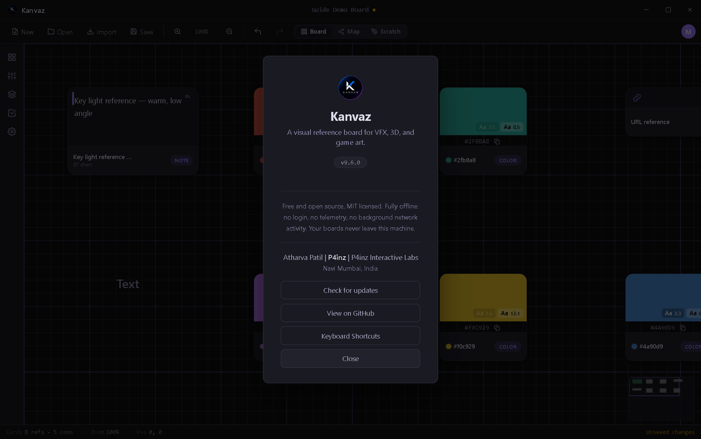

# About Kanvaz

*Verified against Kanvaz v9.6.0.*

Open this same screen any time via the Command Palette (`Ctrl+K` →
"About Kanvaz"), the `I` shortcut, or your account avatar's menu.

## What Kanvaz is

Kanvaz is a visual reference board for VFX, 3D, and game art — a
canvas for collecting, connecting, and understanding the images,
videos, 3D models, and notes you gather while researching or
planning a shot, a level, or a project.

## What it isn't

- **Not a cloud service.** There's no account, no sign-in, and no
  server. Your boards are plain files on your own disk.
- **Not a sync tool.** If you want a board on two machines, you move
  the `.kanvaz` file yourself (or use [Shared Cards](shared-cards.md)
  / [Profile export](profiles.md) for the specific cases those cover).
- **Not a video/image editor.** Kanvaz previews and organizes media;
  it doesn't re-encode video or paint on images. See
  [Import & Export](import-export.md) for exactly what it *can* export.

## Offline and privacy, specifically

Kanvaz is free and open source (MIT licensed) and makes **no background
network calls**. The only two things that ever touch the network, both
opt-in and both disclosed here:

1. **Check for updates** — only when you click the button in this
   dialog, or if the Settings option for automatic checks is on
   (installed Windows/Linux builds only; see [Settings](settings.md)).
2. **Browse community templates / MCP Bridge tool calls** — only if
   you explicitly use those features. See [Templates](templates.md)
   and [MCP Bridge](mcp-bridge.md).

Nothing else — not your boards, not your media, not usage
analytics — ever leaves your machine. See `SECURITY.md` in the
repository for the full disclosed trust model, including how the
[plugin system](plugins.md) is sandboxed.

## Getting help

- **View on GitHub** — the source, issue tracker, and releases
- **Keyboard Shortcuts** — the full reference, also at
  [Keyboard Shortcuts](shortcuts.md)
- This guide folder (`docs/guide/`) — everything else

## Credit

Kanvaz is built by Atharva Patil (P4inz), P4inz Interactive Labs.
