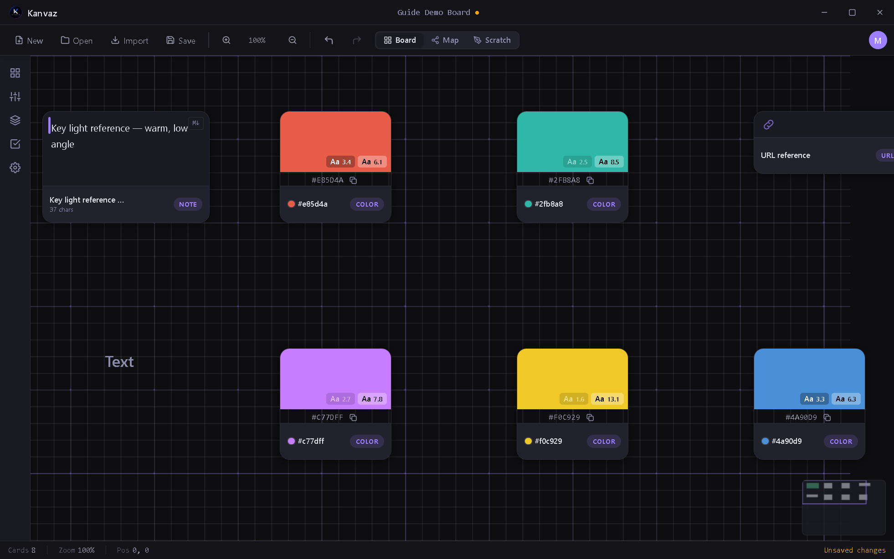

# Board View

*Verified against Kanvaz v9.7.0.*

Board View is the main canvas — a free-form 2D space where reference
cards live, get arranged, and get connected. It's the default view
when you open a board; switch back to it any time from the toolbar or
the `M` shortcut (which toggles [Map View](map-view.md)).

## Card types

Every piece of reference material on a board is a **card**. Kanvaz
recognizes:

| Type | What it holds |
|---|---|
| Image | Any raster image — PNG, JPG, WEBP, TIFF, and more |
| GIF | Animated GIFs, played inline |
| Video | Common video formats, with an inline scrubbable player |
| Audio | Audio files with a waveform preview |
| 3D Model | glTF/GLB, OBJ, FBX, and more — see [Media Previews](media-previews.md) |
| Note | A freeform sticky-note style text card |
| Text | A single styled text label |
| Color | A named/hex color swatch — click it to open Kanvaz's own color picker |
| URL | A link-out reference card |
| File | A reference to a file Kanvaz can't preview inline (still tracked, still linkable) |

## Getting cards onto the board

See [Import & Export](import-export.md) for every path in detail —
drag-and-drop, paste, the Import menu, and PureRef migration all land
here as cards.

## Selecting and arranging

- **Click** a card to select it; **Ctrl+click** or **drag a box**
  (Ctrl+drag) to select several
- **Drag** to move; **arrow keys** nudge 1px, **Shift+arrow** nudges 10px
- **Ctrl+D** duplicates the selection; **Delete** removes it
- **Ctrl+G** groups 2+ selected cards, **Ctrl+Shift+G** ungroups
- Right-click a selection for **Align** and **Distribute** — the same
  operations exposed to the [MCP Bridge](mcp-bridge.md) as
  `alignCards`/`distributeCards`/`tidyUp`

## Per-card panels

With a card selected:

- **`E`** — [Properties](side-panel.md#properties) (transform, opacity, tags, custom key/value properties)
- **`C`** — Connections (wire it to another card — this is what [Map View](map-view.md) visualizes)
- **`A`** — Annotate (draw directly on an image/video/GIF/3D card)
- **`P`** — Pin / unpin
- **`H`** — hide/show its annotations

## Isolate View

`Shift+I` hides every card except the current selection — useful for
focusing on one cluster of a busy board without deleting or moving
anything. Press it again (or `Escape`) to bring everything back.

## Zoom and navigation

| Action | Shortcut |
|---|---|
| Zoom in/out | Scroll, or `+`/`-` |
| Fine zoom | Ctrl+Scroll |
| Pan | Middle-mouse drag, Space+drag, or Alt+drag (works over cards too) |
| Reset zoom | `0` |
| Fit all cards | `F` |
| Zoom to selection | `Shift+F` |
| Save/recall a view | `Ctrl+1..9` to save, `1..9` to jump back |

The full reference, including every card and file shortcut, is in
[Keyboard Shortcuts](shortcuts.md).

## Related

- [Map View](map-view.md) — see the same cards as a connection graph
- [Side Panel](side-panel.md) — Properties, Layers, Tasks, Settings
- [Templates](templates.md) — start from a curated card layout instead of blank
