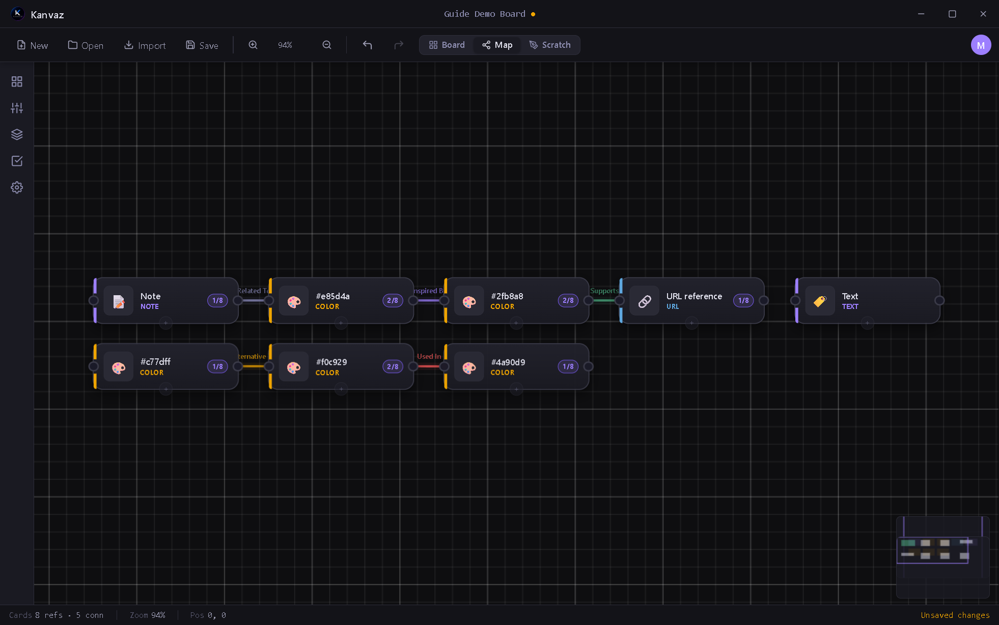

# Map View

*Verified against Kanvaz v9.6.0.*

Map View shows the same cards as Board View, but as a node graph —
every **connection** you've drawn between cards rendered as a labeled,
color-coded edge. It's the answer to "how does everything on this
board relate to everything else," especially once a board has grown
past a glance-able size.

Toggle it from the toolbar (**Map**) or the `M` shortcut.

## Connection types

A connection has a direction and a type, drawn from a small fixed
vocabulary so relationships stay meaningfully distinct rather than one
generic "linked to" line:

| Type | Meaning |
|---|---|
| Related To | General association |
| Inspired By | This card influenced that one |
| Derived From | This is a direct variant/derivative |
| Alternative To | Two options being weighed against each other |
| Supports | This backs up or provides evidence for that |
| Used In | This asset appears in that context |
| References | A citation-style pointer |

Up to 8 connections are allowed between the same pair of cards (for the
rare case where more than one relationship type genuinely applies).
Multiple connections between the same pair fan out into separate
visible arcs instead of overlapping — a real bug found and fixed live
during a v9.6.0 QA pass (see `CHANGELOG.md`).

## Creating a connection

Select a card and press `C` (or right-click → Connections) to open its
Connections panel from either view, then pick the target card and
relationship type.

## Reading the graph

- Each node shows the card's type icon, name, and connection count
- Colors follow the card's tag (if it has one, hashed to a consistent
  hue) or its type otherwise
- Drag nodes to rearrange the layout — Map View remembers your
  arrangement per board
- The same zoom/pan controls as Board View apply here

## Related

- [Board View](board-view.md) — the underlying cards and their content
- [Keyboard Shortcuts](shortcuts.md) — Map View has its own key
  handling while active (see `KanvazMapView.handleKey`)
- [MCP Bridge](mcp-bridge.md) — an AI assistant can create/remove
  connections directly via `connectCards`/`removeConnection`
