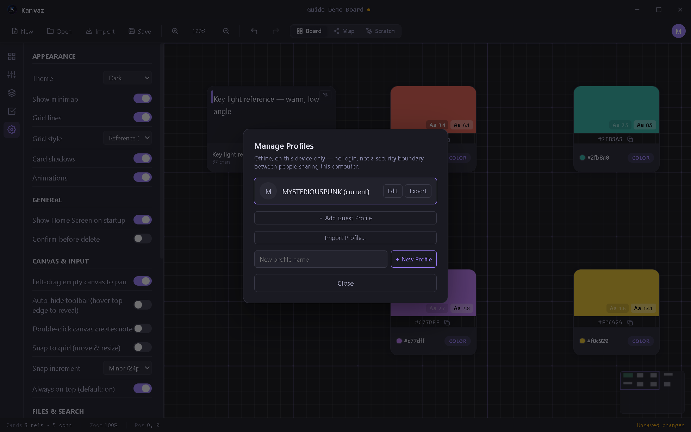

# Profiles

*Verified against Kanvaz v9.6.0.*

Profiles let multiple people share one Kanvaz install while keeping
their own settings, recent-files list, and recovery snapshots
separate — with no login and no password. A profile is a
**preferences partition, not a security boundary**: anyone with access
to the computer can open or switch any profile. There's nothing
locked, and nothing syncs anywhere.

Open **Manage Profiles** from your account avatar (top right).

## What's per-profile

- Settings (everything in [Settings](settings.md))
- The recent-boards list
- Recovery snapshots

## What isn't per-profile

Board files themselves — a `.kanvaz` file is just a file on disk;
any profile can open any board. Profiles only scope *preferences*,
not board access.

## Managing profiles

| Action | What it does |
|---|---|
| **Edit** | Rename the current profile, set its avatar |
| **Export** | Save a profile as a portable `.kanvazprofile` file |
| **Add Guest Profile** | A quick temporary profile |
| **Import Profile…** | Load a `.kanvazprofile` someone exported |
| **+ New Profile** | Create a new named profile |

Switching profiles takes effect immediately — no restart needed.

## First run

A fresh install auto-creates one profile named from your OS username.
Rename it any time via Edit.

## Related

- [Settings](settings.md) — what actually lives inside a profile
- [About Kanvaz](about.md) — the offline/no-account model this fits into
