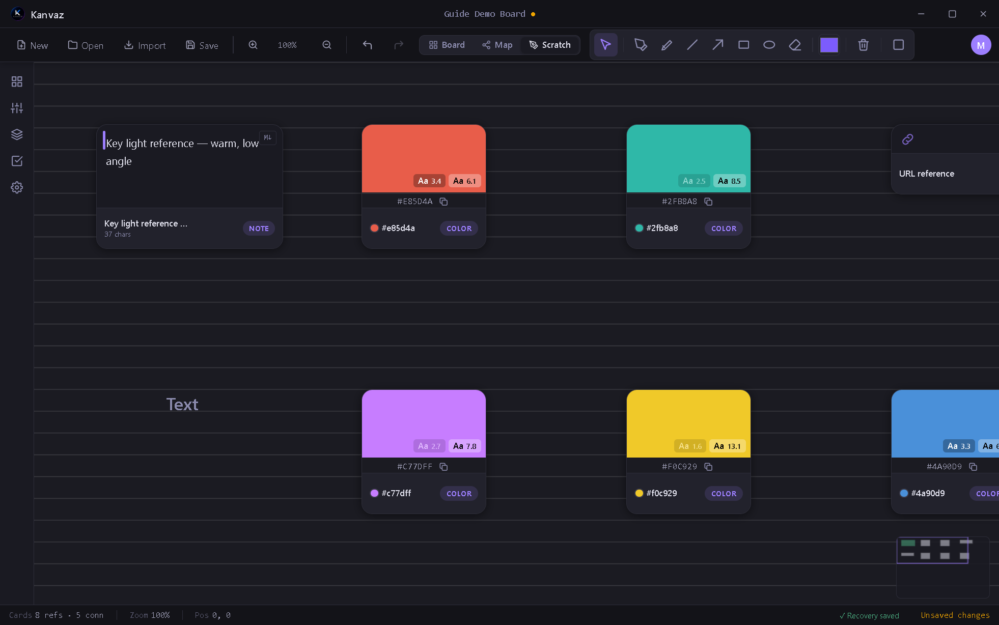

# Scratch Board

*Verified against Kanvaz v9.7.0.*

Scratch Board is a freeform sketch/annotation layer that sits **over**
your cards — a place to scribble notes, circle something, or rough out
an idea without creating a card for it. It's per-board and persists
with the file.

Toggle it from the toolbar (**Scratch**); your cards stay visible
underneath so you can sketch in context.

## Tools

| Tool | Use |
|---|---|
| Select | Pick and move existing strokes |
| Pen | Freehand drawing |
| Highlighter | Wider, translucent strokes for emphasis |
| Line | Straight lines |
| Arrow | Straight lines with an arrowhead |
| Rectangle | Rectangle outline |
| Ellipse | Ellipse outline |
| Eraser | Removes strokes |

A color swatch and stroke-width control sit next to the tools; the
trash icon clears every stroke on the current board.

## Background style

Scratch Board's background (plain, lined, or grid, with configurable
accent colors) is independent of the main canvas grid in
[Settings](settings.md) — it's meant to feel like a physical notebook
page under your reference material, not a redraw of the same grid.

## Related

- [Board View](board-view.md) — the cards Scratch Board sketches over
- [Keyboard Shortcuts](shortcuts.md) — tools 1–7 map to number keys
  while Scratch Board is active
