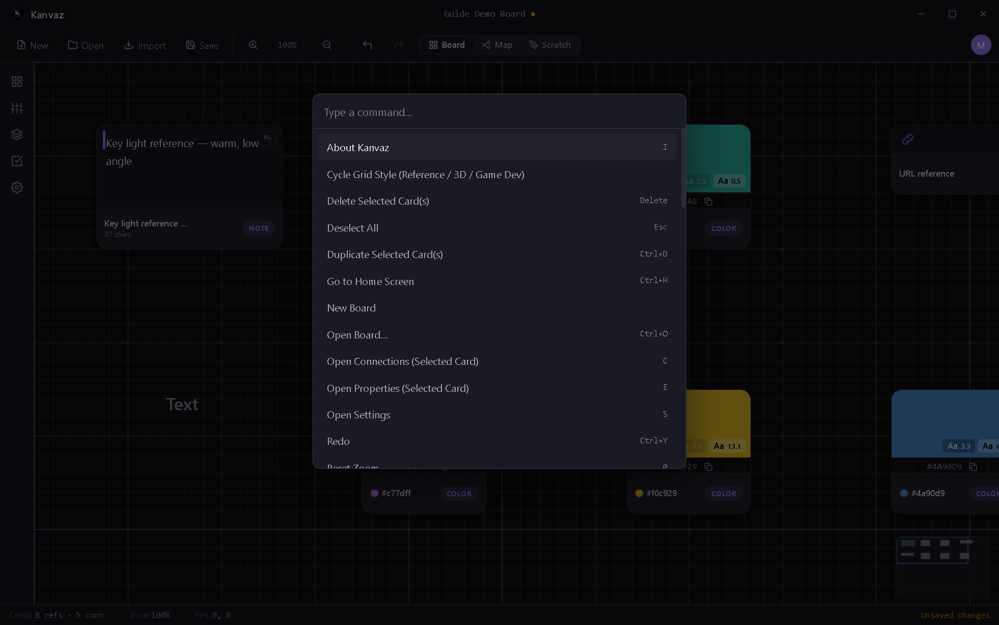

# Command Palette & Smart Search

*Verified against Kanvaz v9.7.0.*

Two different ways to find things fast — one for actions, one for
content.

## Command Palette

`Ctrl+K` opens a fuzzy-searchable list of every registered action in
Kanvaz — core commands and anything a [plugin](plugins.md) registers
via `registerCommand`. It's reachable even while a text field is
focused, and works identically whether you're in Board or Map view.

Type to filter, arrow keys to navigate, Enter to run. Each result
shows its keyboard shortcut, if it has one — see
[Keyboard Shortcuts](shortcuts.md) for the full list.

## Card search

`/` or `Ctrl+F` opens the card search bar over whichever view is
active (Board or Map — it correctly targets the visible one rather
than a hidden overlay). Filters by card type via the type-filter
chips, and supports saved "smart folder" filters you can name and
reuse.

## Smart Search

An optional, **off-by-default** on-device NLP search (toggle it in
[Settings](settings.md) → Files & Search). Once enabled, it indexes
card text/tags/names with lemmatized matching — searching "running"
also finds "run" and "runs" — and ranks results by relevance rather
than plain substring matching. It runs entirely on your machine, in a
background worker, and re-indexes as your board changes.

## Related

- [Keyboard Shortcuts](shortcuts.md) — the complete key reference
- [Settings](settings.md) — enabling Smart Search
- [Plugins](plugins.md) — how a plugin adds its own palette commands
