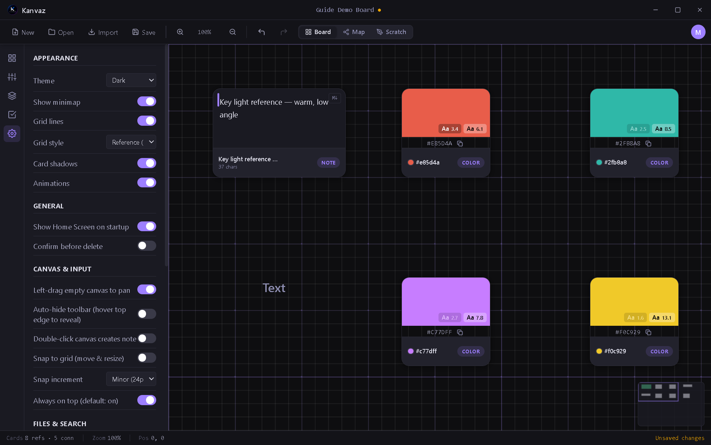

# Settings

*Verified against Kanvaz v9.6.0.*

Open Settings from the left rail's gear icon, the `S` shortcut, or
Command Palette → "Open Settings". Settings are per-[profile](profiles.md)
— each person sharing an install keeps their own.

## Appearance

| Option | What it does |
|---|---|
| Theme | Dark (default), Light, or any theme a [plugin](plugins.md) registers |
| Show minimap | The small navigator in the canvas corner |
| Grid lines | The dot/line grid under your cards |
| Grid style | Reference (default), 3D (origin axes), or Game Dev (tile grid) |
| Card shadows | Drop shadows under cards |
| Animations | UI motion — turn off for a snappier, static feel |

## General

| Option | What it does |
|---|---|
| Show Home Screen on startup | Land on the Home Screen vs. straight into your last board |
| Confirm before delete | An extra "are you sure" before deleting cards |

## Canvas & Input

| Option | What it does |
|---|---|
| Left-drag empty canvas to pan | Pan without needing Space or middle-mouse |
| Auto-hide toolbar | Hover the top edge to reveal it, otherwise hidden |
| Double-click canvas creates note | A quick way to drop a note card |
| Snap to grid | Cards snap to the grid on move/resize |
| Snap increment | Minor (24px) or Major (120px) |
| Always on top | Whether the window floats above others by default (see the Top Mode note in [Keyboard Shortcuts](shortcuts.md)) |

## Files & Search

| Option | What it does |
|---|---|
| Autosave interval | Seconds between autosaves (10–300) |
| Default card width | The width new cards are created at |
| Smart Search | On-device NLP-powered search — off by default; see [Command Palette & Smart Search](search-and-commands.md) |

## Preview Quality

Controls the default render quality for 3D models, PDFs, and Adobe
file previews (Low/Medium/High) — see [Media Previews](media-previews.md).
High quality is flagged with a warning since it costs more to render.

## Advanced

Tucked under an "Advanced" disclosure, split into three groups so
unrelated tools don't get mixed together:

- **Diagnostics** — an FPS/render-time overlay, show card/connection
  IDs, run Map View diagnostics, generate 50 test cards, or export
  debug info to the clipboard
- **Plugin Dev** — Load an unpacked plugin folder for development
  (see [Plugins](plugins.md))
- **Reset** — Reset Kanvaz's settings and cache (does not touch your
  board files)

## Related

- [Profiles](profiles.md) — Settings are scoped per profile
- [Plugins](plugins.md) — plugin-contributed settings panels appear
  in their own section below the built-in ones
