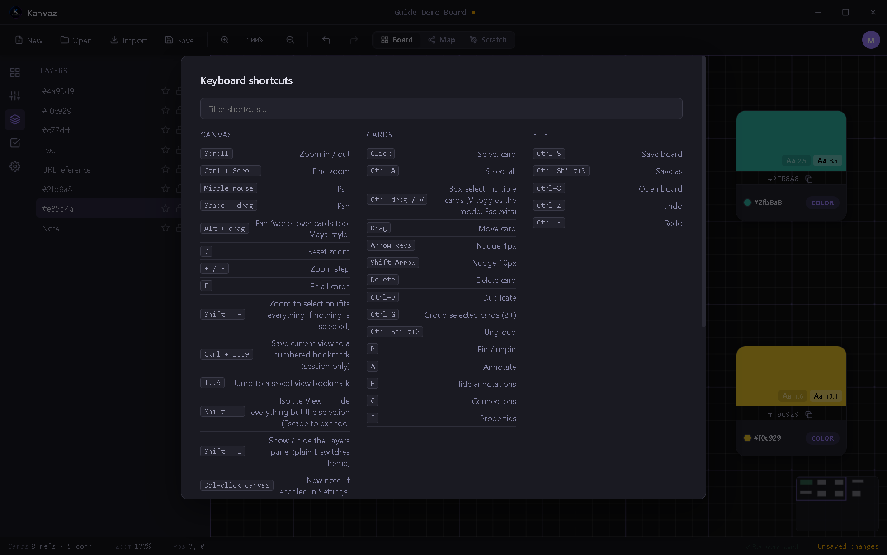

# Keyboard Shortcuts

*Verified against Kanvaz v9.6.0 — transcribed directly from `src/shortcuts.js`
and confirmed live against the in-app reference (`?` any time).*

Press **`?`** anywhere in Kanvaz to open this same reference with a
live filter box. A few of these (Save, Open, Command Palette, Home
Screen toggle, Top Mode) work even while a text field is focused —
noted below.

## Always available

| Shortcut | Action |
|---|---|
| `Ctrl+S` | Save board |
| `Ctrl+Shift+S` | Save as |
| `Ctrl+O` | Open board |
| `Ctrl+F` | Search (routes to Map View's search if Map is active) |
| `Ctrl+K` | Command Palette |
| `Ctrl+H` | Toggle Home Screen |
| `Ctrl+Shift+T` | Toggle Top Mode |

## Canvas

| Shortcut | Action |
|---|---|
| Scroll | Zoom in/out |
| Ctrl+Scroll | Fine zoom |
| Middle-mouse drag / Space+drag | Pan |
| Alt+drag | Pan (works over cards too, Maya-style) |
| `0` | Reset zoom |
| `+` / `-` | Zoom step |
| `F` | Fit all cards |
| `Shift+F` | Zoom to selection (fits everything if nothing selected) |
| `Ctrl+1..9` | Save current view to a numbered bookmark (session only) |
| `1..9` | Jump to a saved view bookmark |
| `/` | Quick search |
| `Shift+I` | Isolate View (hide everything but the selection) |
| `M` | Toggle Map View |
| `L` | Toggle theme (dark/light) |
| `Shift+L` | Toggle Layers panel |
| `S` | Toggle side panel (opens to Settings first time) |
| `Insert` | Toggle side panel (remembers last section) |
| `PageUp` / `PageDown` | Cycle side panel sections |
| `I` | About Kanvaz |
| `?` | This shortcut reference |
| `Escape` | Deselect, close panels, exit Isolate View |
| Double-click canvas | New note (if enabled in Settings) |

## Cards (with a card selected)

| Shortcut | Action |
|---|---|
| Click | Select card |
| Ctrl+A | Select all |
| Ctrl+drag / V | Box-select multiple (V toggles the mode, Esc exits) |
| Drag | Move card |
| Arrow keys | Nudge 1px |
| Shift+Arrow | Nudge 10px |
| Delete / Backspace | Delete card |
| Ctrl+D | Duplicate |
| Ctrl+G | Group selected cards (2+) |
| Ctrl+Shift+G | Ungroup |
| `P` | Pin/unpin |
| `A` | Annotate (image/video/GIF/3D cards only) |
| `H` | Hide/show annotations |
| `C` | Connections |
| `E` | Properties |

## File

| Shortcut | Action |
|---|---|
| Ctrl+S | Save board |
| Ctrl+Shift+S | Save as |
| Ctrl+O | Open board |
| Ctrl+Z | Undo |
| Ctrl+Y (or Ctrl+Shift+Z) | Redo |

## Notes on how these are dispatched

- Shortcuts are suppressed while a text field, textarea, or dropdown
  is focused — except the "Always available" set above, which fires
  regardless (so Ctrl+S always saves, even mid-typing in a note).
- Caps Lock doesn't break modifier detection — shortcuts compare the
  real Ctrl/Shift key state, never the letter's case.
- Map View has its own key handling while active; most Board-only
  shortcuts (zoom, per-card operations) are inactive there.
- Scratch Board owns the number keys 1–7 for its own tools while
  active, taking priority over the view-bookmark shortcuts above.

## Related

- [Board View](board-view.md), [Map View](map-view.md), [Scratch Board](scratch-board.md)
- [Side Panel](side-panel.md) — what `S`, `Shift+L`, `Insert` open
