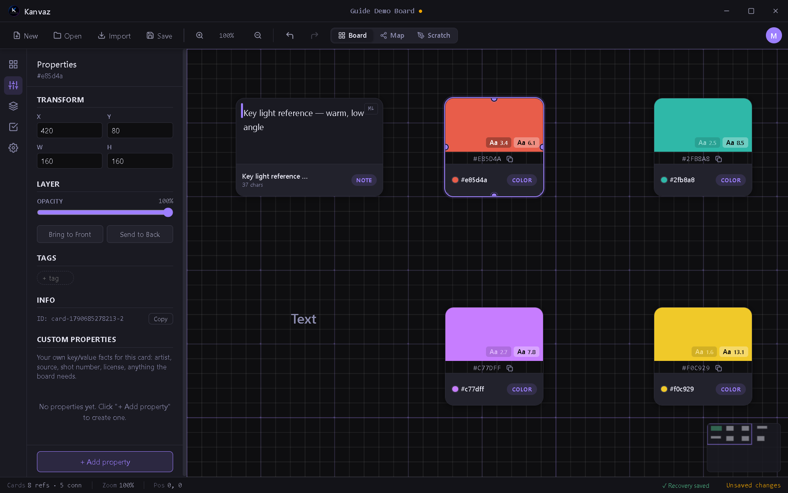
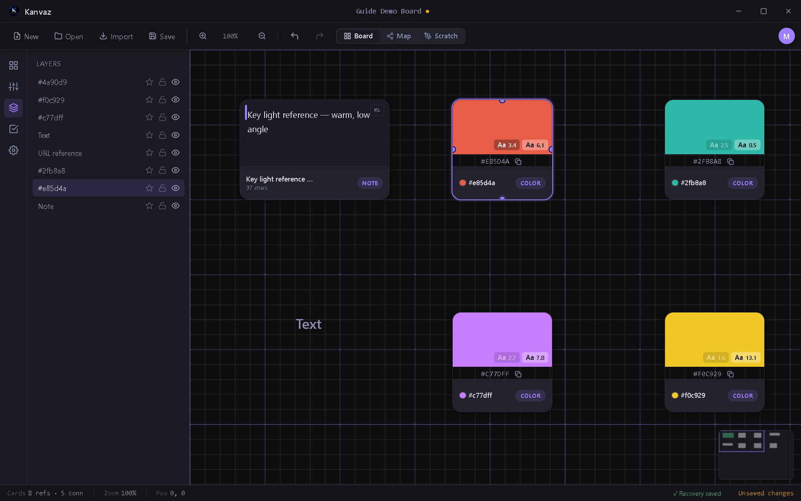

# Side Panel

*Verified against Kanvaz v9.7.0.*

The left rail is the home for everything that isn't the canvas itself
— four sections, each toggleable from its own rail icon or a
shortcut, remembering whichever section you last had open.

| Section | Rail icon | Shortcut |
|---|---|---|
| Properties | sliders | `E` (with a card selected) |
| Layers | stacked squares | `Shift+L` |
| Tasks | checkbox | — (rail icon only) |
| Settings | gear | `S` |

`Insert` toggles the whole panel open/closed (remembering the last
section); `PageUp`/`PageDown` cycle between sections while it's open.

## Properties

Everything about the selected card: transform (X/Y/W/H), layer
controls (opacity, bring-to-front/send-to-back), tags, its internal
ID, and — for text cards — font size and color. The **Custom
Properties** section at the bottom is free-form key/value storage for
whatever your workflow needs (artist, source, shot number, license,
anything).

## Layers

Every card on the board, top to bottom by z-order, with per-row star
(favorite/pin), lock, and visibility toggles. Click a row to select
that card on the canvas.

## Tasks

A per-board checklist — see [Task Tracker](task-tracker.md) for the
full guide, including subtasks and progress tracking.

## Settings

The full options panel — see [Settings](settings.md) for every option
explained.

## Related

- [Board View](board-view.md) — the canvas these panels operate on
- [Keyboard Shortcuts](shortcuts.md) — the complete key reference
